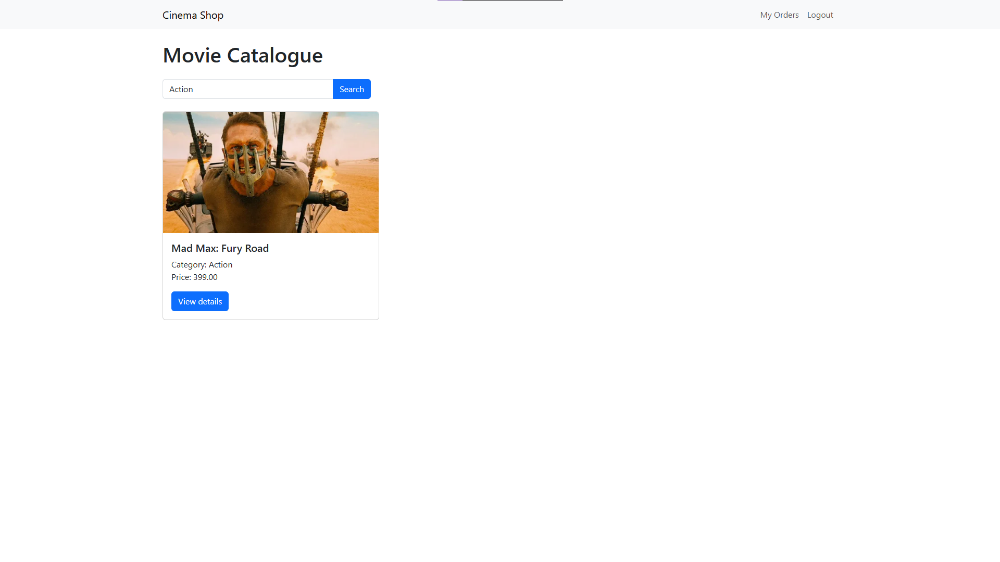

# Laravel internet shop

## Инструкция по установке

### Docker

```bash
docker compose build
docker compose up -d
```

### Bootstrap

В том же контейнере:

```
npm install
npm install bootstrap
npm run dev
```

### Аутентификация Laravel Breeze

В моем любимом контейнере:

```bash
composer require laravel/breeze --dev
php artisan breeze:install
npm install
npm run dev
```

> P.S: При выборе конфигурации breeze выбираем все по умолчанию.


### Запуск Сидеров

Создаст много фильмов, категорий, несколько заказов, а так же пользователей: 

1. admin:admin

2. buyer:buyer

> php artisan migrate:fresh --seed

# Отчёт

## Homepage

**Admin:**


**Authenticated:** - ***Тут также демонстрируется возможность поиска по категории***


**Not Authenticated:** - ***Тут также демонстрируется возможность поиска по названию***


## Авторизация

> Ивользован готовый laravel breeze


## Админ-панель

Тут показаны CRUD функционал админ понелей для разных сущностей базы данных.


## Покупка фильма, просмотр активных заказов на фильм


